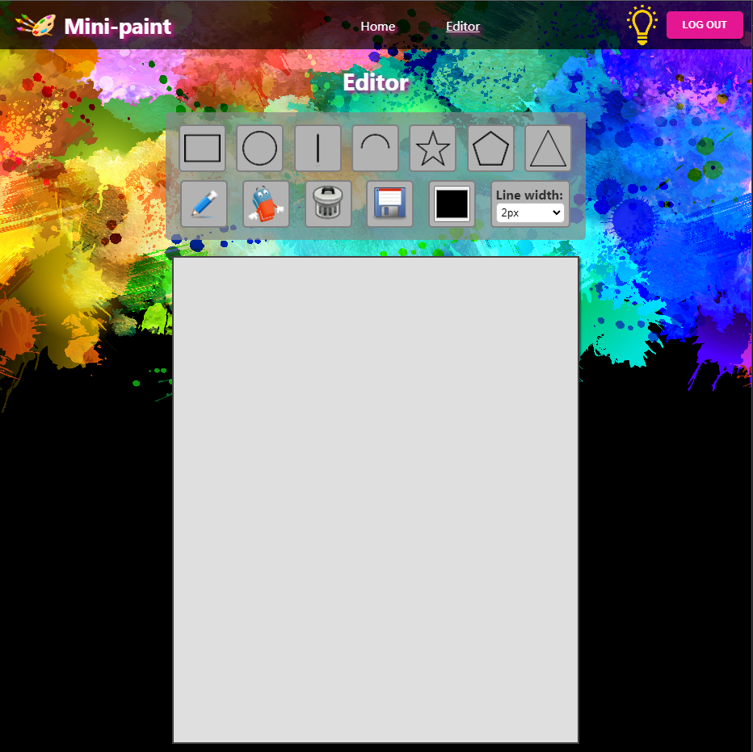
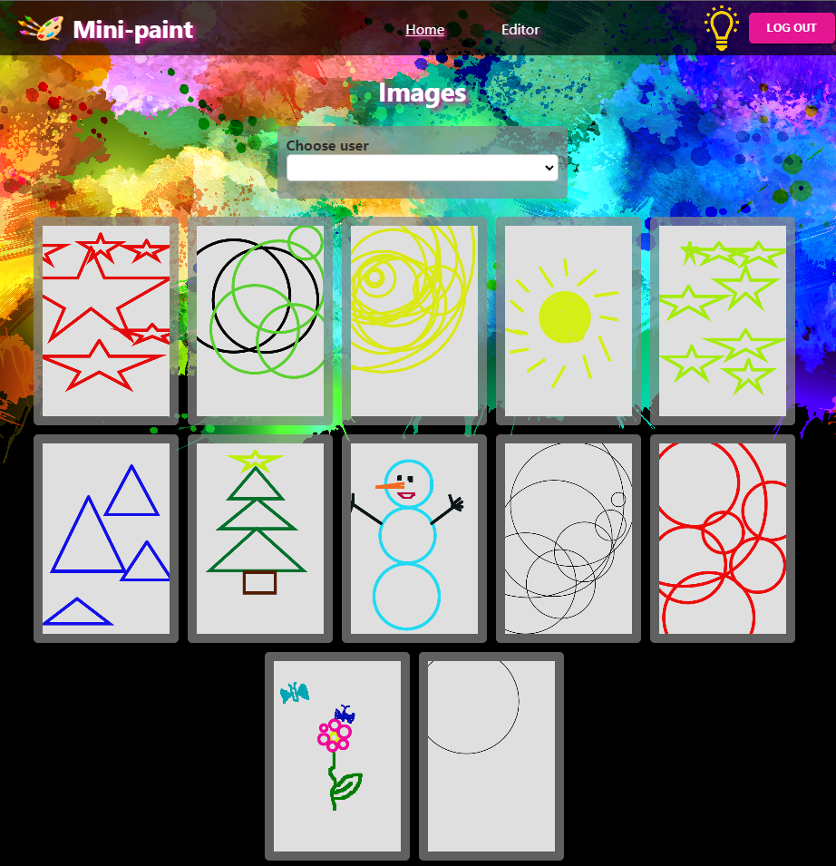
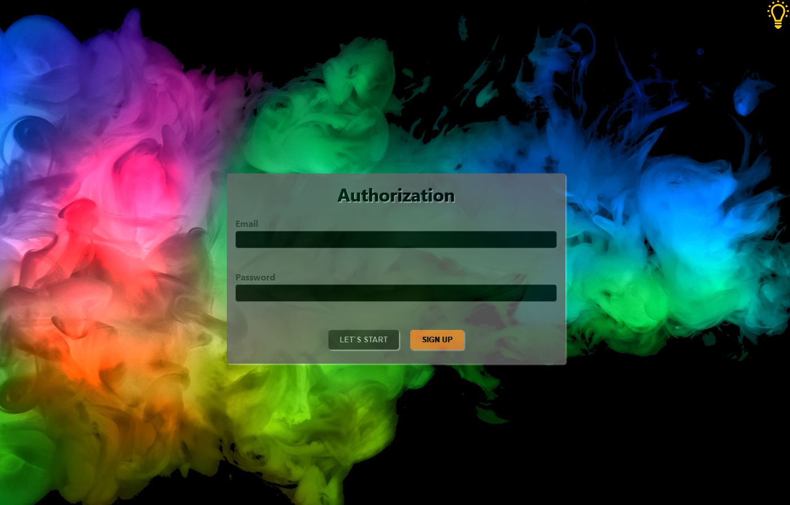
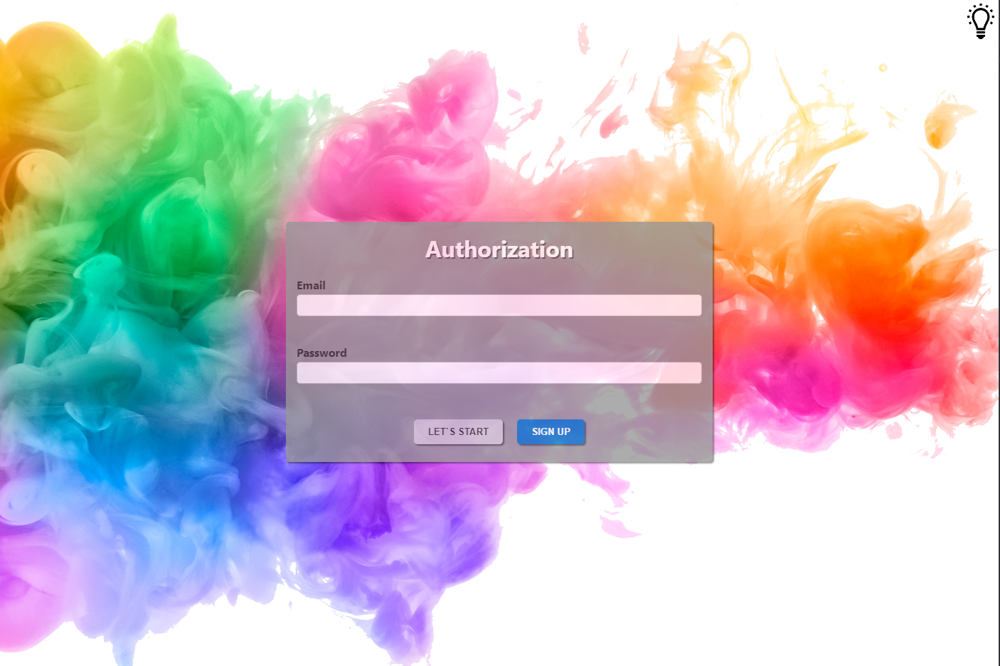
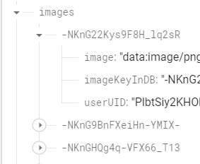
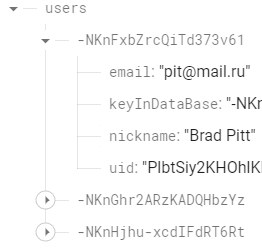

<h1 align="center">
  
  <a
    href="https://github.com/VeriSkas/Mini-paint"
    target="_blank"
  >
    Innowise Lab Internship: Level 2: Mini-paint
  </a>
  
</h1>
<h3 align="center">
  React Typescript React-router-dom React-hook-form React-redux reduxjs/toolkit Canvas Firebase SCSS ESLint Prettier pre-commit hook 
  react-app-rewired alias i18next
</h3>
<h2> Task </h2>
<a
  href="https://drive.google.com/file/d/19cb4whI_HUVPzuaPyaj5r6hGotIVnhho/view"
  target="_blank"
>
  Mini-paint task
</a>

<h2>How to run the app</h2>

Для того, чтобы запустить приложение, нужно:

<a
  href="https://veriskas.github.io/Mini-paint/"
  target="_blank"
>
  Открыть ссылку с задеплоинной версией Mini-paint
</a>
<ol>
  <li>Запустить Вашу IDE.</li>
  <li>Открыть нужную папку с приложением MY-APP</li>
  <li>
    В терминале написать команду npm i, для установки всех настроек и пакетов,
    прописанных в package.json
  </li>
  <li>
    Cделать команду npm start в терминале для запуска приложения в браузере на
    локальном хосте
  </li>
</ol>
<h2>Database snapshot</h2>

<h2>Folders structure</h2>

Приложение состоит следующих файлов и папок:

<ol>
  <li>
    <b>.husky</b> - данная папка содержит настройку команды, обеспечивающей
    pre-commit hook
  </li>
  <li>
    <b>public</b> Содержит главный стартовый файл html
  </li>
  <li>
    <b>src</b> Является основной папкой приложения, содержащей весь
    необходимый код, для корректного функционирования приложения. В ней
    содержатся:
  </li>
  <ul>
    <li>папка assets</li>
    <li>папка components</li>
    <li>папка hooks</li>
    <li>папка interfaces</li>
    <li>папка pages</li>
    <li>папка queries</li>
    <li>папка store</li>
    <li>папка types</li>
    <li>папка utils</li>
    <li> Основные файлы tsx и scss</li>
  </ul>
  <li>
    <b>другие файлы настройки</b>
  </li>
</ol>
